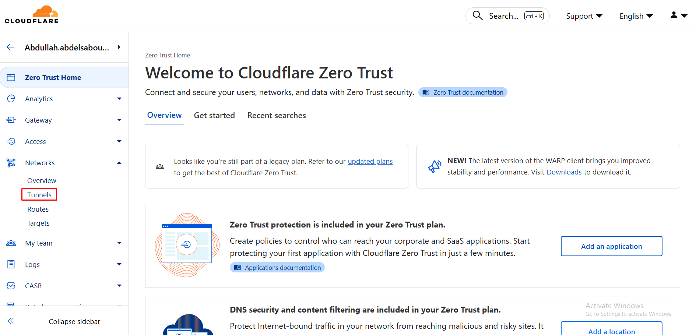
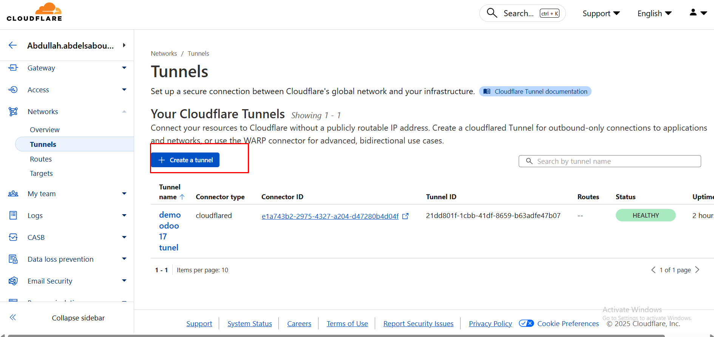
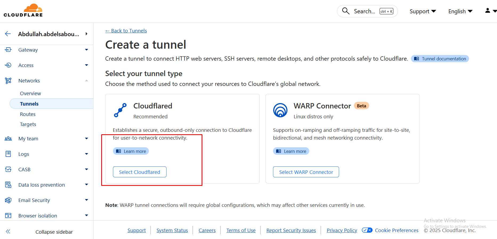
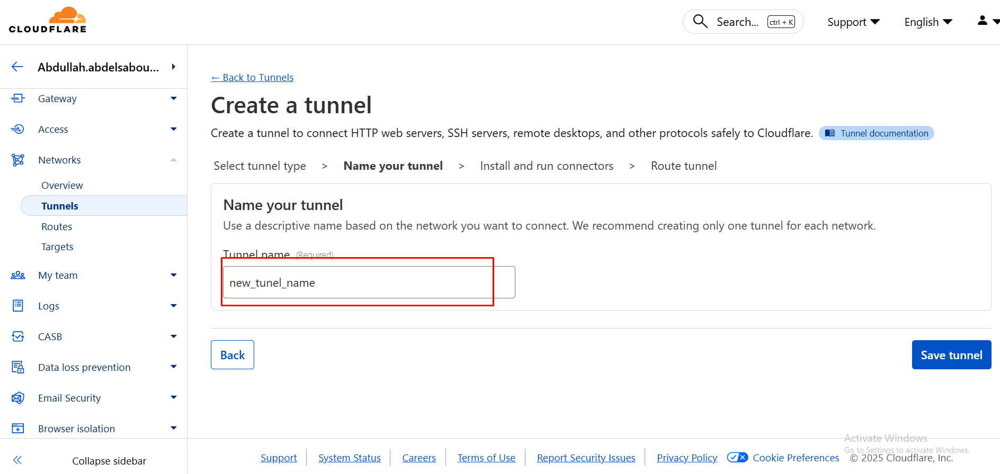
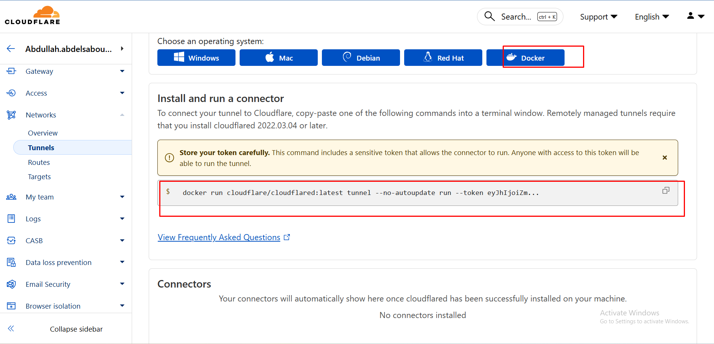
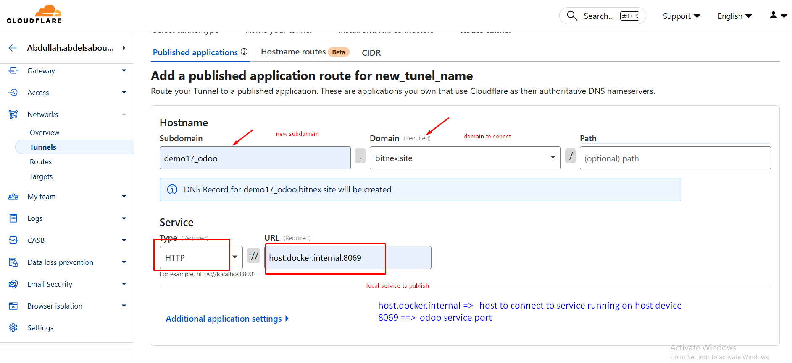

# Cloudflare Tunnel Setup Guide

This repository contains the configuration for setting up Cloudflare Tunnel to securely expose local services (like Odoo) to the internet without opening firewall ports.

## What is Cloudflare Tunnel?

Cloudflare Tunnel creates a secure, outbound-only connection from your local machine to Cloudflare's network. This allows you to:

- Expose local web services to the internet securely
- Connect domains or subdomains without exposing your home IP address
- Bypass NAT and firewall restrictions
- Protect services with Cloudflare's security features
- Access your local services through HTTPS automatically

## Prerequisites

- A Cloudflare account (free tier works)
- A domain added to your Cloudflare account
- Docker and Docker Compose installed on your local machine
- A local service running (e.g., Odoo on port 8069)

## Complete Setup Instructions

### Step 1: Navigate to Cloudflare Zero Trust

1. Log in to the [Cloudflare Dashboard](https://dash.cloudflare.com/)
2. Select your domain from the list
3. Navigate to **Zero Trust** in the sidebar



Click on **Networks** > **Tunnels** to access the tunnel management page.

---

### Step 2: Create a New Tunnel

Click the **Create a tunnel** button to start creating your new tunnel.



---

### Step 3: Select Cloudflared Connector

Choose **Cloudflared** as your connector type. This is the official Cloudflare tunnel client that will run in Docker.



Click **Next** to continue.

---

### Step 4: Name Your Tunnel

Enter a descriptive name for your tunnel (e.g., "odoo-tunnel", "home-server", or "my-services").



Click **Save tunnel** to proceed.

---

### Step 5: Get Your Tunnel Token

After creating the tunnel, Cloudflare will show you the installation instructions with your unique tunnel token.



**Important:**
- Select **Docker** as your environment
- Copy the entire token (it's a long base64-encoded string starting with `eyJhIjoiX...`)
- Keep this token secure - it's like a password for your tunnel
- You'll need this token in the next step

---

### Step 6: Configure Docker Compose File

Open the [docker-compose.yml](docker-compose.yml) file in this repository and update the token.


Replace the token in line 7 with your actual tunnel token:

```yaml
services:
  cloudflare-tunnel:
    image: cloudflare/cloudflared:latest
    container_name: cloudflare-tunnel
    restart: unless-stopped
    command: >
      tunnel --no-autoupdate run --token YOUR_ACTUAL_TOKEN_HERE
    extra_hosts:
      - "host.docker.internal:host-gateway"
```

**Important Notes:**
- The `extra_hosts` configuration allows the Docker container to access services running on your host machine
- Use `host.docker.internal` instead of `localhost` when configuring service URLs

---

### Step 7: Start the Tunnel

Run the following command in the repository directory:

```bash
docker-compose up -d
```

Verify the tunnel is running:

```bash
docker-compose ps
docker-compose logs -f cloudflare-tunnel
```

You should see logs indicating the tunnel has connected successfully.

---

### Step 8: Configure Public Hostname (Route Traffic)

Back in the Cloudflare Zero Trust Dashboard, configure the public hostname to route traffic to your local service.



1. In your tunnel configuration, go to the **Public Hostname** tab
2. Click **Add a public hostname**
3. Configure the settings:
   - **Subdomain**: Enter your desired subdomain (e.g., `odoo`, `app`, `erp`)
   - **Domain**: Select your domain from the dropdown
   - **Path**: Leave empty for root path routing
   - **Type**: Select **HTTP** (Cloudflare will handle HTTPS)
   - **URL**: Enter `http://host.docker.internal:8069` (for Odoo) or your service's port

4. Click **Save hostname**

**Example Configuration for Odoo:**
- Public URL: `https://odoo.yourdomain.com`
- Service URL: `http://host.docker.internal:8069`

---

### Step 9: Test Your Connection

1. Wait a few moments for the configuration to propagate
2. Open your browser and navigate to your configured subdomain (e.g., `https://odoo.yourdomain.com`)
3. You should see your local Odoo instance (or other service) accessible through the internet
4. The connection is automatically secured with HTTPS by Cloudflare

---

## Connecting Multiple Local Services

The `docker-compose.yml` is configured with `host.docker.internal:host-gateway`, which allows the container to access services running on your host machine.

### Single Tunnel, Multiple Services

You can create multiple public hostnames for the same tunnel, allowing you to expose different services through different subdomains:

| Subdomain | Local Service | Configuration |
|-----------|---------------|---------------|
| `odoo.yourdomain.com` | Odoo ERP | `http://host.docker.internal:8069` |
| `api.yourdomain.com` | API Server | `http://host.docker.internal:3000` |
| `app.yourdomain.com` | Web Application | `http://host.docker.internal:8080` |
| `admin.yourdomain.com` | Admin Panel | `http://host.docker.internal:5000` |

### Adding Additional Services

1. Go to your tunnel in Cloudflare Zero Trust Dashboard
2. Click **Public Hostname** tab
3. Click **Add a public hostname**
4. Configure each service with its subdomain and local port
5. All services will use the same tunnel token

---

## Managing the Tunnel

### Start the tunnel
```bash
docker-compose up -d
```

### Stop the tunnel
```bash
docker-compose down
```

### Restart the tunnel
```bash
docker-compose restart
```

### View logs
```bash
docker-compose logs -f cloudflare-tunnel
```

### Check tunnel status
```bash
docker-compose ps
```

### Update cloudflared to latest version
```bash
docker-compose pull
docker-compose up -d
```

---


## Common Use Cases

### Use Case 1: Exposing Odoo 
Perfect for accessing your local Odoo development instance from anywhere:
- Public URL: `https://odoo.yourdomain.com`
- Service: `http://host.docker.internal:8069`
- Benefits: Test Odoo with real domain, webhook integrations, mobile access

### Use Case 2: Development API Testing
Share your local API with frontend developers or for webhook testing:
- Public URL: `https://api.yourdomain.com`
- Service: `http://host.docker.internal:3000`
- Benefits: Real HTTPS for testing, shareable URLs, webhook callbacks

### Use Case 3: Remote Access to Home Services
Access your home server applications from anywhere:
- Home Assistant, Plex, NAS admin panels
- Secure remote access without port forwarding
- Protection via Cloudflare Access policies

---

## Useful Commands Reference

### Docker Commands
```bash
# Start tunnel in foreground (see logs directly)
docker-compose up

# Start tunnel in background
docker-compose up -d

# Stop tunnel
docker-compose down

# View live logs
docker-compose logs -f cloudflare-tunnel

# View last 100 log lines
docker-compose logs --tail=100 cloudflare-tunnel

# Restart tunnel
docker-compose restart

# Update image and restart
docker-compose pull && docker-compose up -d

# Check tunnel status
docker-compose ps

# Execute command inside container
docker exec -it cloudflare-tunnel sh
```


## Useful Links

- [Cloudflare Tunnel Documentation](https://developers.cloudflare.com/cloudflare-one/connections/connect-apps/)
- [Cloudflared GitHub Repository](https://github.com/cloudflare/cloudflared)
- [Cloudflare Zero Trust Dashboard](https://one.dash.cloudflare.com/)
- [Cloudflare Community Forum](https://community.cloudflare.com/)
- [Cloudflare Status Page](https://www.cloudflarestatus.com/)

---

## FAQ

**Q: Do I need to open any ports on my router/firewall?**
A: No! That's the beauty of Cloudflare Tunnel. It creates an outbound-only connection, so no port forwarding needed.

**Q: Can I use this with the free Cloudflare plan?**
A: Yes! Cloudflare Tunnel is available on the free tier.

**Q: How many services can I expose through one tunnel?**
A: You can expose unlimited services through a single tunnel by adding multiple public hostnames.

**Q: Will this work with WebSocket connections?**
A: Yes, Cloudflare Tunnel supports WebSocket connections automatically.

**Q: Can I use custom paths (e.g., yourdomain.com/app)?**
A: Yes, you can configure path-based routing in the public hostname settings.

**Q: What happens if my tunnel disconnects?**
A: The cloudflared client automatically reconnects. The `restart: unless-stopped` policy ensures the container restarts if it crashes.

**Q: Is this suitable for production?**
A: Yes, many companies use Cloudflare Tunnel in production, but ensure you implement proper security policies and monitoring.

**Q: Can I see who's accessing my services?**
A: Yes, check the Analytics and Logs sections in Cloudflare Zero Trust Dashboard for detailed access logs.

---

## License

This configuration is provided as-is for educational and development purposes.

